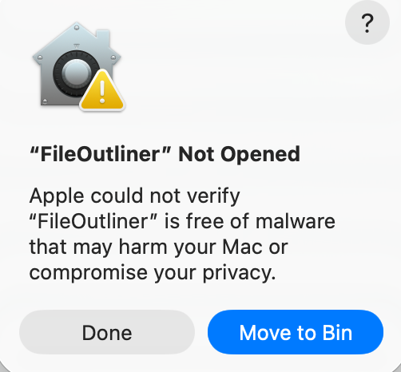

# FileOutliner

FileOutliner is a local-first Markdown note app with an outliner editor:
1. Notes are edited in an outliner (infinite-list) experience inspired by WorkFlowy and Logseq.
2. Notes stay as plain `.md` files in your workspace, so they remain easy to manage with Git or any editor.

## Why FileOutliner

- Local Markdown files (no database lock-in)
- Outline-first editing with collapsible node tree
- File-tree workspace navigation with fast note switching
- Toggle between `Outliner mode` and `Source code mode`

## Current Features

- **File tree:** create/rename/delete/move files and folders, filter `.md`/all files, quick open (`Ctrl/Cmd+P`), auto-focus active file, and multi-tab editing.
- **Editor:** inline node editing, indent/outdent, drag-and-drop + `Alt+Up/Alt+Down` reorder, zoom into subtree, and image paste to workspace `images/`.
- **Search & organization:** in-file and workspace text search (`Ctrl/Cmd+F`, `Ctrl/Cmd+Shift+F`), labels from trailing hashtags (for example `#todo`), and file-level bookmarks.
- **UX:** light/dark theme, font controls, shortcuts help, and export current note as PDF.

## Demo

## Price

This app is free for everyone.

Tips are never expected but always appreciated: [Buy Me a Coffee](https://buymeacoffee.com/secfree.seed).

## Privacy and Security

FileOutliner sends only one telemetry event, `app_active_daily`, to PostHog when you open the app. This event is used solely to count Daily Active Users (DAU).
No other data is collected, and your notes are never scanned.

## Feedback

If you encounter any issues while using the app, please open an issue [here](https://github.com/secfree-seed/FileOutliner/issues/new).

For questions, please email `secfree.seed@gmail.com`.

## FAQ

### "Apple could not verify xxx is free of malware"

You may encounter the warning below when opening the app on macOS.

To open the app anyway, follow Apple's instructions:
https://support.apple.com/en-sg/guide/mac-help/mchleab3a043/26/mac/26.3

